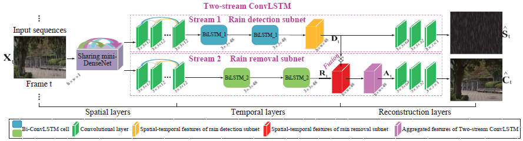

# Removing Rain in Videos: A Large-scale Database and A Two-stream ConvLSTM Approach

Tie Liu, Mai Xu, Zulin Wang

[[Paper Link](https://arxiv.org/abs/1906.02526)] (ICME'19)

Rain removal has recently attracted increasing research attention, as it is able to enhance the visibility of rain videos. However, the existing learning based rain removal approaches for videos suffer from insufficient training data, especially when applying deep learning to remove rain. In this paper, we establish a large-scale video database for rain removal (LasVR), which consists of 316 rain videos. Then, we observe from our database that there exist the temporal correlation of clean content and similar patterns of rain across video frames. According to these two observations, we propose a two-stream convolutional long- and short- term memory (ConvLSTM) approach for rain removal in videos. The first stream is composed of the subnet for rain detection, while the second stream is the subnet of rain removal that leverages the features from the rain detection subnet. Finally, the experimental results on both synthetic and real rain videos show the proposed approach performs better than other state-of-the-art approaches.

       @article{liu2019removing,
        title={Removing Rain in Videos: A Large-scale Database and A Two-stream ConvLSTM Approach},
        author={Liu, Tie and Xu, Mai and Wang, Zulin},
        journal={arXiv preprint arXiv:1906.02526},
        year={2019}
        }

![Video_class]
(./src_img/fig1.png)

## LasVR-Dataset

**A large-scale video database for rain removal (LasVR)**. The videos of our database contain a wide range of content categories, e.g., animal, nature landscapes, human scenes, action sports, man-made object and so forth. Additionally, the rendered streaks vary from light drizzling to heavy rain storm and vertical rain to slash line. The training, validation and testing sets consist of 261, 27 and 28 rain videos.

**Download LasVR-Dataset:**

[[Dropbox](https://www.dropbox.com/s/cf1q283dvwvpby9/LasVR.zip?dl=0)]     [[BaiduYun](https://pan.baidu.com/s/1uyrCiK7rtFzOYKGBaf_D5w)] (passpord:bwg0)

## Framework

