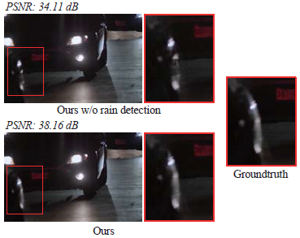
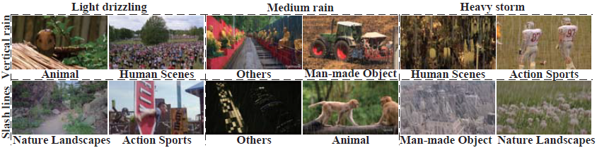

# Removing Rain in Videos: A Large-scale Database and A Two-stream ConvLSTM Approach

Tie Liu, Mai Xu, Zulin Wang

[[Paper Link](https://ieeexplore.ieee.org/document/8784876)] (ICME'2019 Oral)

Rain removal has recently attracted increasing research attention, as it is able to enhance the visibility of rain videos. However, the existing learning based rain removal approaches for videos suffer from insufficient training data, especially when applying deep learning to remove rain. In this paper, we establish a large-scale video database for rain removal (LasVR), which consists of 316 rain videos. Then, we observe from our database that there exist the temporal correlation of clean content and similar patterns of rain across video frames. According to these two observations, we propose a two-stream convolutional long- and short- term memory (ConvLSTM) approach for rain removal in videos. The first stream is composed of the subnet for rain detection, while the second stream is the subnet of rain removal that leverages the features from the rain detection subnet. Finally, the experimental results on both synthetic and real rain videos show the proposed approach performs better than other state-of-the-art approaches.

**Highlights**
- We construct **a large-scale dataset** of 316 synthetic rain videos.
- We propose a novel deep learning architecture with two-stream ConvLSTM based subnets for the joint tasks of rain streak detection and removal on videos..

<p align="center">

</p>

## LasVR-Dataset


**A large-scale video database for rain removal (LasVR)**. The videos of our database contain a wide range of content categories, e.g., animal, nature landscapes, human scenes, action sports, man-made object and so forth. Additionally, the rendered streaks vary from light drizzling to heavy rain storm and vertical rain to slash line. The training, validation and testing sets consist of 261, 27 and 28 rain videos.

**Download LasVR-Database:**

[[Dropbox](https://www.dropbox.com/s/cf1q283dvwvpby9/LasVR.zip?dl=0)]     [[BaiduYun](https://pan.baidu.com/s/1uyrCiK7rtFzOYKGBaf_D5w)] (password:bwg0)

## Training
Main code is in main.py. We cropped training videos into numerous 64x64x9 cubes, and the code for feeding traing data should be done by users.

**Environment**
- Python
- TensorFlow
- TFLearn

## Citation
If you find this work helpful, please cite:
```
@inproceedings{liu2019removing,
  title={Removing rain in videos: a large-scale database and a two-stream ConvLSTM approach},
  author={Liu, Tie and Xu, Mai and Wang, Zulin},
  booktitle={2019 IEEE International Conference on Multimedia and Expo (ICME)},
  pages={664--669},
  year={2019},
  organization={IEEE}
}
```

## Contact
liutie@buaa.edu.cn, tieliu0@gmail.com (Tie Liu)

## License
You can use, redistribute, and adapt the material for non-commercial purposes, as long as you give appropriate credit by citing our paper and indicating any changes that you've made.
